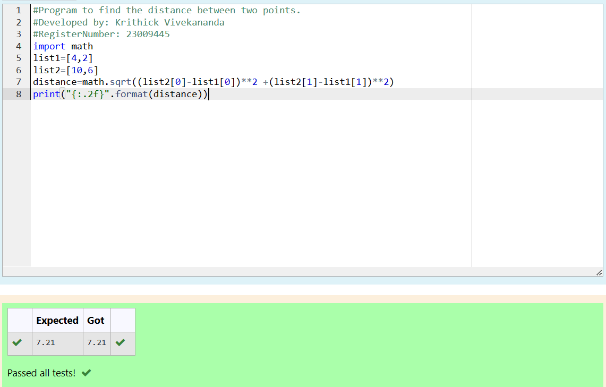

# DISTANCE-BETWEEN-TWO-POINTS

## AIM:
To write a python program to find the distance two 2 points
## ALGORITHM:
### Step 1: 
Import the module named math.
### Step 2: 
Assign the values to the variables.
### Step 3: 
Substitute the values in the distance formula.  
### Step 4: 
Print the distance with 2 decimal points.
### Step 5: 
End the Program.
### PROGRAM:
```python
#Program to find the distance between two points.
#Developed by: Krithick Vivekananda
#RegisterNumber: 23009445
import math
list1=[4,2]
list2=[10,6]
distance=math.sqrt((list2[0]-list1[0])**2 +(list2[1]-list1[1])**2)
print("{:.2f}".format(distance))

```
  


### OUTPUT:


### RESULT:
Thus the program to find the distance between two points is written and verified using a python programming.
